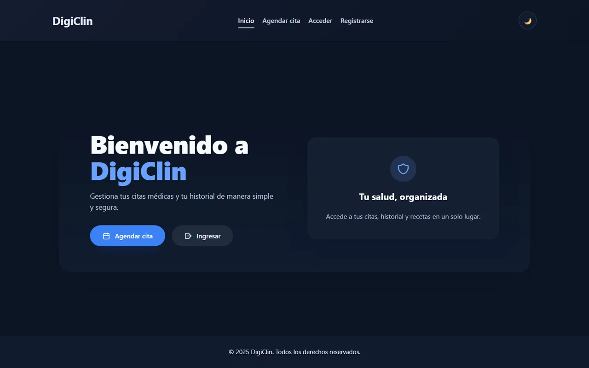

**English** | [Español](README.es.md)

# DigiClin

A clinic management system: patients book appointments, doctors and staff manage them,
and medical records live behind role-based access instead of in a filing cabinet.

**Live at [digiclin-system-v2.onrender.com](https://digiclin-system-v2.onrender.com)**



Built as an MVP and handed over to the client. The second implementation — the first one
is archived at [digiclin-system](https://github.com/BryanBel/digiclin-system).

> **Note on the demo.** It runs on Render's free tier, so the instance sleeps when idle
> and the first request after a while takes about a minute to wake it. Later requests are
> immediate.

## Three roles, three surfaces

Each role gets its own area of the app, and the API enforces the boundary on every route
rather than trusting the interface to hide things.

| Role | Can reach |
| ---- | --------- |
| **Patient** | Their own appointments and their own medical history, nothing else |
| **Doctor** | The full appointment schedule and patients' medical histories, including writing new entries |
| **Admin** | All of the above, plus patient records and the incoming appointment-request queue |

Authorization is a per-route gate that answers `401` without a session and `403` when the
role does not match. `/api/medical-history` lists every record for `admin` and `doctor`; a
patient reaching the same module uses `/my`, which is scoped to them. Hiding a menu item
is not access control, so the check lives on the server.

Two endpoints are deliberately public, and only two: `POST /api/appointment-requests`, so
someone can ask for an appointment before they have an account, and
`GET /api/appointment-requests/link/:token`, where the token in the URL *is* the
credential — it is emailed to the requester and grants access to that one request.

This was not always true. The whole appointment-requests module and two of the
appointments routes once ran with no check at all, which left the intake queue — names,
emails and reasons for visit — readable by anyone, and let anyone confirm or reschedule
someone else's appointment. The giveaway was inside the confirm handler itself, which
recorded `res.locals.user?.id ?? null` for a user the route never required, and so always
stored `null`. A global middleware populates that user when a session cookie is present
but never rejects, so a route that does not check explicitly is simply open.

## The API

28 endpoints across six modules.

| Module | Mounted at | What it covers |
| ------ | ---------- | -------------- |
| Auth | `/api/auth` | Register, email verification, login, session, logout |
| Appointment requests | `/api/appointment-requests` | The intake queue: create, confirm, reschedule, and a token link so someone can follow their request without an account |
| Appointments | `/api/appointments` | Booking and listing, both "mine" and the full schedule |
| Medical history | `/api/medical-history` | Records and their file attachments |
| Patients | `/api/patients` | Patient records; `/me` for the patient's own |
| Patient lookup | `/api/patients/lookup` | The one public read, used before an account exists |

Request bodies and query strings are parsed with [Zod](https://zod.dev) schemas kept in
`*.routes.schemas.js` next to each module's routes.

## Data model

Eight tables: `users`, `patients`, `appointments`, `appointment_requests`,
`medical_history`, `attachments`, `visits` and `emergency_intake`.

## Authentication and security

| Concern | How it is handled |
| ------- | ----------------- |
| Passwords | bcrypt, 10 salt rounds. Never stored or logged in the clear |
| Sessions | A JWT access token valid for one day, in an **httpOnly cookie** — not in `localStorage`, where any script on the page could read it |
| Cookie flags | `secure` and `sameSite: none` in production, `lax` in development, so the cookie is not sent over plain HTTP |
| Email verification | A separate JWT with its **own secret** and a one-hour expiry, so a leaked verification link cannot be replayed as a session |
| Cross-origin | CORS restricted to an allowlist read from `CORS_ORIGIN`, with credentials enabled |
| File uploads | PDF, PNG and JPG only, checked by MIME type; at most 5 files of 10 MB each. Stored under a generated `mh-<timestamp>-<uuid>` name, so a caller cannot choose the path a file lands on |

## Architecture

A pnpm workspace with two packages. The front-end is built first and copied into the
back-end, so a single Render web service serves both the API and the static assets — one
deploy, one domain, no CORS between the two halves in production.

```
app/
  frontend/   # Astro, React islands, Tailwind
  backend/    # Express + PostgreSQL; also serves the built front-end when NODE_ENV=prod
```

## Running it locally

```sh
pnpm install
pnpm run dev     # Astro on 4321, Express on 3000
```

Environment variables are loaded from `app/backend/.env`.

| Variable | Purpose |
| -------- | ------- |
| `DATABASE_URL` | PostgreSQL connection string |
| `ACCESS_TOKEN_SECRET` | Signs the session cookie — 48 random bytes, not a word |
| `EMAIL_VERIFICATION_SECRET` | Signs verification links — keep it different from the one above |
| `CORS_ORIGIN` | Comma-separated allowlist of origins |
| `BACKEND_URL` / `FRONTEND_URL` | Used to build links in outgoing email; must match the deployed domains |
| `RESEND_API_KEY` *or* `EMAIL_USER` + `EMAIL_PASS` | Email delivery, through [Resend](https://resend.com) or plain SMTP |
| `SEED_PASSWORD` | Password for the accounts `pnpm run seed:prod` creates. At least 12 characters; the script refuses to run without it |

`app/backend/.env.example` lists every variable the code reads. Copy it to `.env` and fill
it in — `.env` is ignored by git, and must stay that way.

## Deploying

```sh
pnpm run build:client   # builds the front-end and copies it into app/backend/dist
pnpm run start          # NODE_ENV=prod, Express serves the API and that directory
```

On Render: a Web Service on Node 20+, build command
`pnpm install --frozen-lockfile && pnpm run build:client`, start command `pnpm run start`.
Render injects `PORT` and the server already respects it.

---

Built by Bryan Belandria — [github.com/BryanBel](https://github.com/BryanBel)
